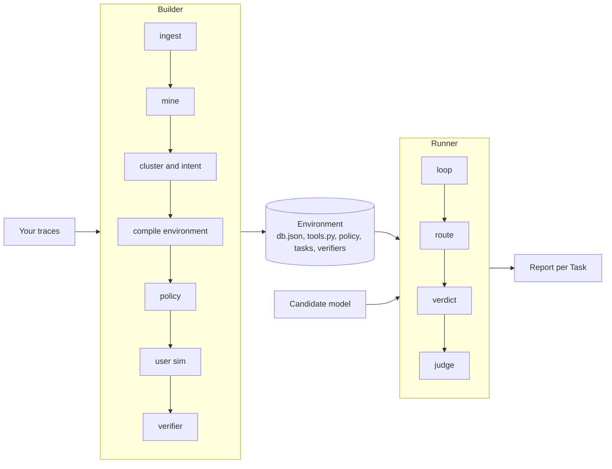
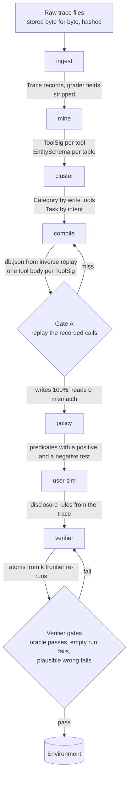
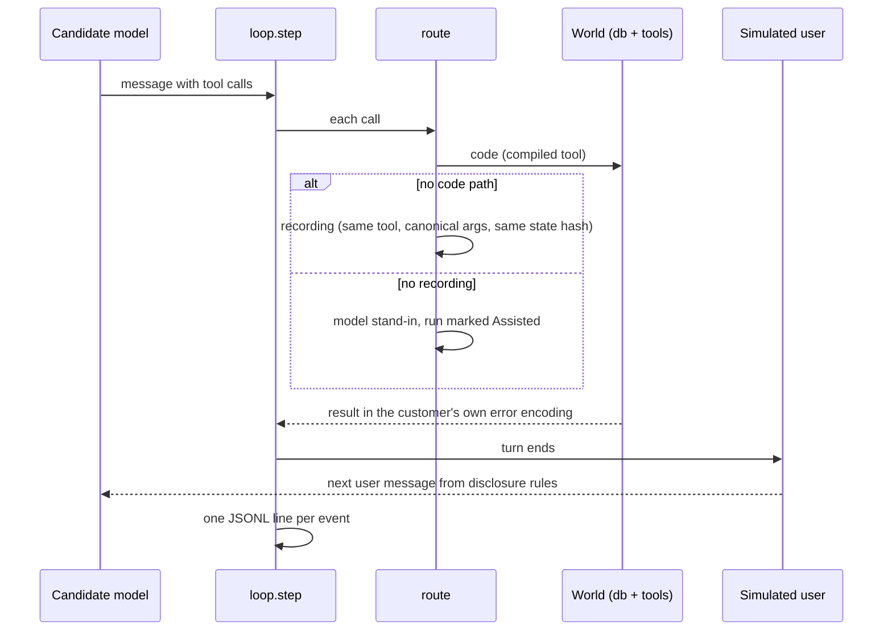

# Kullback

Kullback rebuilds the world your AI agent works in from the traces it already produced, then runs cheaper models through that world and tells you, task by task, which ones still get the job done.

It is the open-source Builder and Runner behind [Leibler](https://leibler.dev). Apache-2.0. Python 3.11.

## 1. What this is and what pain it solves

If you run an agent in production, you have a log of everything it did: the prompt it got, the tools it called, what the tools answered, what it wrote back. You probably also pay a frontier model for every one of those runs, and you probably suspect that a cheaper model could handle a good share of them. The problem is proving it.

The usual way to find out is to build an eval. Someone writes tasks by hand, someone else mocks the tools, a judge model scores transcripts, and after a few weeks you have numbers nobody fully trusts, because the mocks drift from the real system and the judge grades the wording rather than the outcome. The tasks that matter most, long multi-turn runs with many tool calls, are the ones the hand-built eval covers worst.

Kullback starts from the other end. Your traces already contain the tasks, the tool signatures, the data the tools returned and the effect every write had. That is enough to reconstruct an executable copy of your system: a database with the rows your runs touched, one function per tool that behaves the way the real tool was observed to behave, the policy rules your agent was told to follow compiled into checks, and a simulated user who knows what the real user knew. Once that copy exists, any model can be run through the same conversations, and the result is graded on what it changed in the world, not on how it talked about it.

Two things follow from grading the end state instead of the transcript. The grader is code, so it is cheap and it does not have opinions. And a model that reaches the right outcome by a different route is not punished for the route, which is the whole point of asking whether a different model can do the job.

## 2. How it solves it

Kullback is two programs over one set of data records.



The Builder reads traces and writes an Environment. The Runner takes an Environment, a recorded run and a candidate model, replays the conversation and computes a Verdict. They share nothing but the record definitions; the Runner cannot import the Builder, and a test checks that.

### The Builder, stage by stage

Every stage is a function over records on disk, content-addressed, with a code gate at the end. A stage that fails its gate hands the artifact back to the stage that produced it, with the failure attached, for a bounded number of retries. A share of every Task's runs is held out from the start and never used for building, so the numbers you see at the end are measured on runs the Builder did not see.



Ingest stores your files unchanged and hashed, then derives trace records from them. Every derived field carries a pointer back to the byte range it came from, so a wrong value can always be traced to its source. Benchmark grader fields, if your traces are from a benchmark, are stripped into a sidecar that only the final comparison code may read.

Mine works out, for each tool, the union of every argument and result field ever observed, with counts and first and last sighting, and whether the tool reads or writes. Reads and writes are decided by rule from the name and confirmed by diffing state before and after the call; a tool nobody can classify defaults to read and gets a flag that blocks the setup review until a person answers it. The same pass recovers the tables and columns behind the tools, and marks each column as exempt (ids, timestamps), hard (must match exactly) or semantic (may differ in form).

Cluster groups runs into Categories by the set of tools they write through, then into Tasks by similarity of intent inside each Category. Membership is decided by code; a model only names the cluster. Intent writes the one-line task description, and every noun phrase in it has to point at a span in a member run. An intent grounded in a single run is refused.

Compile builds the shared database by replaying the corpus backwards (latest observation wins), with a per-Task overlay of the rows each Task's runs actually saw, and writes one tool body per signature. A tool body is written by a model but has to pass five gates in order: it parses, it executes on the starting state, it is deterministic, it does not return a constant, and it reproduces held-out recorded calls. A body that fails gets at most three rewrites with growing evidence, then the tool is marked assisted and every run that touches it is reported separately.

Policy turns the rules in the system prompt into predicates that run before every write, each shipped with one passing and one failing test. A rule that cannot be compiled is rewritten into a checkable form for review; if that fails too it becomes a judge question, and if the judge rejects it, it is listed as residual and never enters a Verdict.

User sim writes the rules for a simulated user from the recorded one. Facts are exact; style is representative. If the candidate asks for something the trace never contained, the simulated user answers from the starting state, and if the world does not have it either, says so, and the run is marked.

Verifier derives the pass condition for each Task from what the frontier model did in k re-runs: the set of writes present in every successful re-run is required, the writes present in some are allowed, and anything else is forbidden. Each written value carries its provenance: a user utterance, a tool result or a policy rule. A Verifier enters the pool only after the recorded run passes it, an empty run fails it, a plausible wrong run fails it, and a grep finds no leaked reference in it.

### The Runner



The loop is one function that advances a single turn, so the wrapper for any environment standard is packaging rather than redesign. Route tries code first, then an exact recording, then a model stand-in; the route taken is on the event, and a run served by a stand-in anywhere gets no counted Verdict. Verdict is a separate pass over the run's JSONL and the Task's Verifier, code only: required atoms present, forbidden writes absent, policy predicates never fired, the user's questions answered. It reports pass or fail with the failing atom and whether the candidate took the same path as the recording or a different one.

Where a judgment call is unavoidable (a semantic column whose strings differ, a rule that could not be compiled, the cause of a failure), two agentic judges with read access to the starting and end state each have to cite a span and run at least one tool check. If they disagree, the run goes to a queue for a person. A judge can remove a run from the bar or widen a Verifier for every candidate; it can never award a pass.

The report opens with whether the Environment was built at all (which gates passed, how many tools are assisted, how many Tasks have too few runs to be guarded), then gives per-Task numbers and a suggestion. The decision is yours; the routing plan is written from what you decide, not from the suggestion.

## 3. Results

Everything below comes from the offline part of the first slice: Sierra's public tau2-bench retail run (Claude 3.7 Sonnet as the agent, GPT-4.1 as the simulated user, 456 runs over 114 tasks), with no model calls anywhere. tau2-bench is the one place where we hold the ground truth (the real `tools.py`, the real `db.json`), so it is where the reconstruction can be checked exactly. Full numbers with the scripts that produced them are in `SLICE_RESULTS.md`.

Ingest read 456 runs, 3,591 tool calls, 109 tool errors and 0 truncated results. A hand count over the raw JSON, importing nothing from Kullback, gives the same four numbers. Three runs checked call by call match exactly. Hashes are identical across two ingests into separate directories.

Mining recovered 15 tool signatures from the calls alone. Against tau2's own `tools.py`, argument names match 15 of 15 in both directions, with nothing missing and nothing extra. The mined set of write tools is identical to tau2's seven. Read or write class matches on 13 of 15; the two misses are tau2's `calculate` and `transfer_to_human_agents`, which have no side effects and fell to the read-and-flagged default. The recovered schema has tau2's three tables with identical column sets, including the seven optional order fields that only appear in post-write results.

The reconstructed starting state matches tau2's `db.json` on every one of the 252 rows the runs touched: orders 161 of 161, products 38 of 38, users 53 of 53.

Gate A, replaying the recorded calls through tau2's own tools against our reconstructed database, on 20 seed runs and 10 held-out runs (257 calls): writes 37 of 37 and 20 of 20 after canonicalization, reads 125 of 125 and 65 of 65, recorded errors reproduced 6 of 6 and 4 of 4, end state over written rows 33 of 33 and 17 of 17. Replaying against tau2's original database instead of ours gives the same numbers in every cell.

Clustering is the one place the shipped default is wrong. At the configured intent threshold of 0.3 the 456 runs fall into 74 Tasks with purity 0.53 against tau2's task ids, including one Task of 58 runs; at 0.6 the same code gives F1 0.72 and purity 0.87. The ceiling for any clustering by write tools is about 80%, because only 91 of tau2's 114 tasks have all four trials writing through the same tools. The default will move.

The code is 22 modules, about 8,900 lines, with 756 tests that run in nine seconds and never call a model.

What has not been measured yet, because it needs a live model: the compiled tool bodies and policy predicates, the Verifier on a real Task, candidate runs and the agreement between our Verdicts and tau2's own reward. Those are the next numbers, and they will be published whether they are good or not.

## 4. Why you should care

If you pay for a frontier model per agent run, this is the shortest path we know of to an answer to "which of these runs could a cheaper model handle" that is measured on your own runs, graded on outcomes, and checkable down to the byte in your traces that each number came from.

If you build evals, the design choices are worth stealing even if the code is not: the trace is the only source of truth and every derived value points back into it; the grader is code and a judge can only narrow the bar, never award a pass; every stage has a held-out set and reports the seed number beside the held-out number; a run that needed a model stand-in for any tool is reported, never counted.

If you build environments for training agents, the Builder is an environment generator whose only input is production traces, with a reconstruction check against a known ground truth, and the loop is already the shape a `reset` and `step` wrapper needs.

If you work on any of this, the design document, the decision log with every choice and the alternative it beat, and 29 research reports are in `docs/` and `research/`. Disagreement with the design is welcome; the decision log exists so that you can see what was already argued.

## 5. Future work

In rough order.

The end-to-end build with a live model: the `build` and `run` commands are wired to stages that exist, but the orchestration that needs a model (tool bodies, policy predicates, tool classification) is not written yet, and steps 5 to 8 of the slice (Verifier on the cancel-pending-order Task, candidate runs with a cheaper model, Verdict against tau2's reward, regrade after an environment fix) run only once it is.

A sandbox for model-written tool code. Today compiled tools run in a subprocess for the compile gates but in-process for the Runner. Nothing from a customer's traces should be compiled before that changes.

The re-run count k, decided by experiment rather than by us: the atom sets stop changing at some k on tau2 retail, and that is the default.

More trace formats on ingest: OpenTelemetry GenAI in both dialects, Claude Code JSONL, MCP logs. tau2 native is the only one wired today.

An OpenEnv wrapper over the loop, so the Environments run anywhere that standard is accepted.

The parts of the design that are named and deferred: a filter that chooses which runs are worth re-executing when there are more than the budget; reference confirmation as its own module (the slice uses tau2's references); the dispute path for end states outside the required and allowed sets; a statistics module with paired non-inferiority intervals and pass^k; mining user behaviour, not only tools, so the simulated user is calibrated on how often real users volunteer facts or walk away; anonymization at the customer boundary; hardening Tasks with traps and perturbations, only after the base Environment holds.

The Builder improving itself: it can already edit its own prompts and rules, commit the change as a node in a memory tree and have an evaluator outside the loop accept or reject it on the held-out runs, one change per round. What it learns on one customer travels to the next as a lessons file it is required to argue the relevance of before applying.

## Getting started

```
uv sync
uv run pytest
uv run harness ingest path/to/traces.json --workdir work
```

`CONTRIBUTING.md` says how to get a change in and which rules the code keeps. `DEVELOPING.md` covers the layout, the records, the offline test models and the fixtures. `docs/harness-design.md` is the spec; `docs/decision-log.md` is why.
