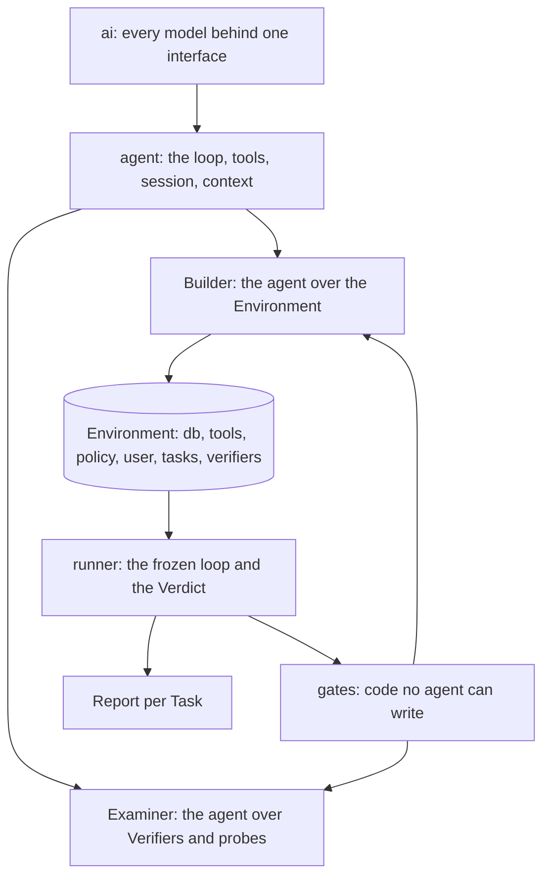

<div align="center">
  <h1>Kullback</h1>
  <p><strong>Find out how well a model performs in your own environment — then train one on it.</strong></p>
  <p>
    <a href="#quick-start"><strong>Quick Start</strong></a> ·
    <a href="#why-kullback"><strong>Why Kullback</strong></a> ·
    <a href="#commands"><strong>Commands</strong></a> ·
    <a href="#how-it-works"><strong>How It Works</strong></a> ·
    <a href="#explore"><strong>Explore</strong></a>
  </p>

  <a href="LICENSE"></a>
  <a href="https://www.python.org"></a>
  
</div>

Your traces already hold the tasks, the tool signatures, what the tools returned, and the effect of every write. That is enough to rebuild an executable copy of your system and grade any model on what it changed in it. The grader is code, so it is cheap and has no opinions.

Kullback rebuilds the world your agent works in from the traces it already produced, checks the rebuild by replaying those traces, grows the rebuilt database with synthetic rows shaped by the real ones, and runs other models through it, graded on what they changed. The runs that pass are the training data for the next model.

It is the open-source Builder and Runner behind [Leibler](https://leibler.dev). Apache-2.0.

## Quick Start

```bash
uv sync
uv run kullback ingest path/to/traces.json --workdir work
uv run kullback build --workdir work --model provider/model --grow users=500 --workers 8
uv run kullback freeze-runner --workdir work --yes
uv run kullback run --workdir work --task <task id> --model provider/candidate --count 3
uv run kullback verdict --workdir work
uv run kullback report --workdir work
```

`kullback tui` shows the build as it runs. `build --iterate` resumes from the cache, `--target` builds one stage and what it needs, `--agent` lets the model drive the Builder. Live model calls need `HARNESS_ALLOW_MODEL_REQUESTS=1` and an API key, from the environment or a `.env` in the working directory.

## Why Kullback

- **Grade what changed, not what was said.** The Verdict is a code-only pass over the End state: required writes present, forbidden writes absent, policy never broken, the user's questions answered. Where judgment is unavoidable, two judges each cite a span and a disagreement goes to a person; a judge can never award a pass.
- **A stand-in is reported, never counted.** Tool calls go to code first, then to an exact recording, then to a model stand-in — and the route taken is on the event. A run served by a stand-in anywhere is excluded from every number.
- **Use any model behind one id.** `provider/model` resolves through built-in adapters or the models.dev registry, so a provider nobody wrote code for is one flag away. Keys come from the environment, never from a command line.
- **Rebuilds you can trust.** Every Builder stage ends in a code gate; the Runner freezes on a person's confirmation; every Verdict carries the hash of both. A hand-built eval takes weeks and drifts — this one replays your own traces.
- **Synthetic rows that confess.** The database grows with rows composed by rules read off the observed ones, tagged as synthetic, so nothing built on them is mistaken for the real thing.

## How It Works

Traces go in, an Environment comes out, candidates run in it, code grades what they changed, you read the report. Two agents, one runner and one set of gates, on a layering inspired by [huggingface/tau](https://github.com/huggingface/tau).



The Builder turns traces into an Environment: a database with the rows your runs touched, one function per tool that behaves as the real tool was observed to behave, the policy rules compiled into checks that run before every write, a simulated user who knows what the real user knew, and a Verifier per Task derived from the recorded runs. A model writes a tool body; five gates judge it.

The Runner takes an Environment, a recorded run and a candidate model, and advances one turn at a time. When the run stops, the Verdict is code over what changed. The report opens with whether the Environment was built at all (gates passed, assisted tools, Tasks with too few runs), then gives per-Task numbers and a suggestion.

The gates are the part no model may touch. They run on every artifact the Builder makes, the Runner is frozen once a person confirms it, and every Verdict carries the hash of both.

```
kullback/
  ai/         models, the provider stream, pricing
  agent/      the agent core: loop, tools, session, context
  builder/    the Environment agent
  examiner/   the Verifier and probe agent: derivation, probes, repairs, refusals, findings
  runner/     the frozen loop and the Verdict; serves both agents
  gates/      every accept-or-reject check; serves both agents, no model call
  cli.py      the command line
  tui/        the terminal screen
  report.py   the customer-facing report
```

## Commands

| Command | What it does |
| --- | --- |
| `ingest FILES --workdir` | Load customer trace exports into the workdir |
| `build --workdir --model` | Build the Environment (`--iterate` resumes, `--target` builds one stage, `--agent` lets the model drive, `--grow`/`--workers`/`--ceiling-usd` bound it) |
| `freeze-runner --workdir` | Freeze the Runner on a person's confirmation (`--by`; `--yes` skips the prompt, for CI) |
| `run --workdir --task --model` | Run a candidate (`--count`, `--seed` for batches) |
| `verdict --workdir` | Code-only Verdict over what changed (`--task` for one Task) |
| `regrade --workdir` | Re-score stored Runs against a new Verifier |
| `report --workdir` | The customer-facing report (`--out`, `--batch`) |
| `tui --workdir` | The terminal screen over a live build |

## Environment Variables

| Variable | Purpose |
| --- | --- |
| `HARNESS_ALLOW_MODEL_REQUESTS` | Set to `1` to allow live model calls (tests stay offline without it) |
| `OPENAI_API_KEY` | Key for OpenAI models |
| `ANTHROPIC_API_KEY` | Key for Anthropic models |
| Provider-specific variable | Key for any other registry provider; use the exact variable named by the models.dev snapshot (`/login` reports it, `/keys` shows whether it is set) |

Keys come from the environment or a `.env` in the working directory (see `.env.example`). They are never printed and never written to a workdir.

## Ways to Run It

- **As a pipeline.** The six commands above, end to end, in CI or on a dev box.
- **As a screen.** `kullback tui` watches stages, gates and spend as the build runs.
- **As a loop.** `build --iterate` resumes from the content-addressed cache and keeps improving; `build --agent` hands the session to the model.
- **Fully offline.** Tests run on `TestModel`/`RecordedModel` with no network; builds reproduce byte-identical artifacts from fixtures.

## Explore

- `CONTRIBUTING.md` — how to get a change in
- `DEVELOPING.md` — the records, the offline models, the fixtures
- `docs/harness-design.md` — the spec
- `docs/decision-log.md` — why
- `docs/todo.md` — what comes next
