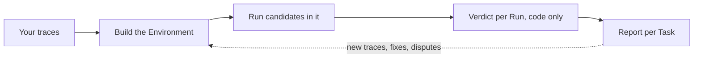
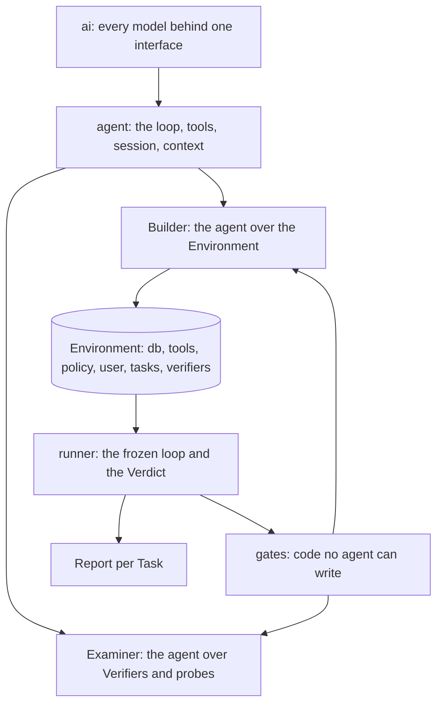

# Kullback

Kullback is the way to find out how well a model performs in your own environment, and then to train one on it. It rebuilds the world your agent works in from the traces it already produced, checks the rebuild by replaying those traces, grows the rebuilt database with synthetic rows shaped by the real ones, and runs other models through it, graded on what they changed. The runs that pass are the training data for the next model.

It is the open-source Builder and Runner behind [Leibler](https://leibler.dev). Apache-2.0. Python 3.11.

## 1. The problem

If you run an agent in production you have a log of everything it did: the prompt, the tools it called, what they answered, what it wrote back. You pay a frontier model for every run and suspect a cheaper model, or a small model trained on your own runs, could handle a good share of them. Proving that is the hard part.

The usual way is a hand-built eval. Someone writes tasks, someone mocks the tools, a judge model scores transcripts, and weeks later you have numbers nobody trusts, because the mocks drift from the real system and the judge grades the wording rather than the outcome. The runs that matter most, long and multi-turn with many tool calls, are the ones such an eval covers worst, and a model that steps one row off the recorded path meets an empty world.

Kullback starts from the other end. Your traces already contain the tasks, the tool signatures, the data the tools returned and the effect of every write. That is enough to rebuild an executable copy of your system: a database with the rows your runs touched, one function per tool that behaves the way the real tool was observed to behave, the policy rules compiled into checks, and a simulated user who knows what the real user knew. The rows the traces did show are the evidence for the rows they did not. The database is grown to the size of the real one with synthetic users, orders and the rest, composed by structural rules read off the observed rows (which field is a key to which table, which list repeats which row, which total is a sum of which lines) and tagged so nothing built on them is mistaken for the real thing.

Any model can then run the same conversations in that world, graded on what it changed rather than on how it talked about it. The grader is code, so it is cheap and has no opinions, and a model that reaches the right outcome by a different route is not punished for the route. The same environment is where a small model gets its training data: trajectories that pass the Verifier inside a world rebuilt from your traces. Every number is published beside the environment gates that produced it, so a good training number cannot hide a bad environment.

## 2. How it works

Traces go in, an Environment comes out, candidates run in it, code grades what they changed, you read the report and decide. What you decide, plus the next week of traces, feeds the next build.



Inside that loop there are two agents, one runner and one set of gates, on a layering borrowed from huggingface/tau: a provider layer, an agent core that knows nothing about the application, and the applications as extensions on that core.



The Builder is the agent that turns traces into an Environment. Its stages are tools over a declared graph: each stage names what it reads and what it writes, a stage starts when everything it reads is complete, and independent stages run side by side. Every artifact is content-addressed, so a build that is resumed does only the work whose inputs changed. Out of the box a code driver walks the graph in order and calls no model beyond what the stages need. With `--agent` the model drives the session itself, choosing which tool to call next from what the gates told it.

1. Ingest stores your files unchanged and hashed and derives trace records from them. Every derived field points back to the bytes it came from. Benchmark grader fields are stripped into a sidecar that only the final comparison reads.
2. Mine recovers each tool's signature from its calls, decides whether it reads or writes (by name, then confirmed by diffing state before and after), and recovers the tables and columns behind the tools. A tool nobody can classify is flagged for a person.
3. Cluster groups runs into Tasks by the tools they write through and the similarity of their intent. Membership is decided by code; a model only names the cluster and writes a one-line intent whose every noun points at a span in a member run.
4. The starting state is built by replaying the corpus backwards, then grown on request (`--grow users=500`) with synthetic rows composed from the observed ones, checked for key closure, id shape and duplication, and tagged so a run that reads one is reported as assisted.
5. Compile writes one tool body per signature. A model writes the body, but it must pass five gates: parses, executes on the starting state, deterministic, not a constant, reproduces held-out recorded calls. Three rewrites, then the tool is marked assisted.
6. The rules in the system prompt become predicates that run before every write, each with a passing and a failing test; a rule that cannot be compiled becomes a judge question and never enters a Verdict. The simulated user is written from the recorded one: facts exact, style representative.
7. Every trace is replayed through the built tools with its own assistant and user turns. A trace whose writes all match and whose reads never differ in substance is a confirmed Reference. Each Task's Verifier is derived from its confirmed References and the frontier re-rolls beside them: writes present in every successful run are required, writes present in some are allowed, anything else is forbidden. A Verifier enters the pool only after the recorded run passes it, an empty run fails it, a run cut short fails it and a plausible wrong run fails it.

The gates are the part no model may touch. Every accept-or-reject check lives in one package, `kullback/gates`, as a function over an artifact that returns a ruling; a registry names every gate and the artifact it rules over. When the Builder is driven by a model the gates run inside the hook on every tool result, so the model sees the ruling with the artifact and cannot skip it, and a second hook refuses any tool call that would write under `gates/` or `runner/`. The hash of the gates package is stored beside the hash of the runner, so a Verdict names the exact code that produced it.

The Runner takes an Environment, a recorded run and a candidate model. One function advances one turn: the candidate's tool calls are routed to code first, then to an exact recording, then to a model stand-in, and the route taken is on the event. The simulated user answers from the recorded user's facts. When the run stops, the Verdict is a separate code-only pass over the run's events and the Task's Verifier: required atoms present, forbidden writes absent, policy predicates never fired, the user's questions answered. A run served by a stand-in anywhere, or that read a synthetic row, is reported and never counted. The Runner is frozen once a person confirms it (`kullback freeze-runner`), and stored runs can be re-scored against a fixed Environment without re-running the model.

Where a judgment call is unavoidable (two strings that may mean the same thing, a rule that could not be compiled, the cause of a failure) two agentic judges with read access to the starting and end state each cite a span and run at least one tool check. If they disagree the run goes to a person. A judge can remove a run from the bar or widen a Verifier for every candidate; it can never award a pass.

The report opens with whether the Environment was built at all (gates passed, assisted tools, Tasks with too few runs), then gives per-Task numbers and a suggestion.

## 3. The layout

The package is `kullback` at the repository root. Each subpackage imports only what sits below it, and an import-linter contract in the pre-commit hook keeps it that way.

```
kullback/
  ai/         the Model interface, the offline models, the provider stream, pricing, usage
  agent/      messages, tools, events, the stateless loop, the harness, the session tree,
              the context tools and the 40% floor
  runner/     records, canon, confinement, budget, the frozen loop, route, verdict, judge,
              regrade, replay, scorecard
  gates/      every accept-or-reject check and the registry that names them; no model call
  builder/    the Environment agent: its stages, its tools, its extension on the agent core
  examiner/   the Verifier and probe agent; empty until phase 5
  cli.py      the command line
  tui/        the terminal screen
  report.py   the customer-facing report
```

Two things in the agent core are worth knowing before reading the Builder. The loop is stateless: it takes a state, a model and a tool registry and returns when the model stops, with hooks before each tool call and after each tool result. Context is managed by the model, with a code floor: the model may forget, recall, load and unload, and when it leaves the context over the line the code compacts for it and records that it had to.

## 4. Next

The Examiner comes first: a second agent on the same core, with its own session and prompt, that owns Verifier derivation and the probe pool, may tighten a Verifier freely and loosen it only toward what the frontier did. After it, the repair verbs, a ratchet so a stage never replaces a passing artifact with a failing one, a lesson so the next build reads the gate failures of the last, and stage prompts as skills the model may rewrite under a gate. Then the round: the Builder and the Examiner take turns on one workdir until a round improves nothing or the spend ceiling is reached.

Beyond the loop, in rough order: the live build measured against the real system on every domain we hold the ground truth for (`docs/live-build.md` has the first); synthetic Tasks on top of the synthetic rows; a UI over the Builder and Runner; more trace formats on ingest; the post-training experiment, a small open model trained on trajectories that passed the Verifier and measured against the frontier model that produced the traces; an OpenEnv wrapper over the loop. `docs/todo.md` has the full list with the reasoning, `docs/decision-log.md` every choice and the alternative it beat, and `docs/tech/rebuild-phases.md` the phases with a note per phase that landed.

## Getting started

```
uv sync
uv run pytest
uv run kullback ingest path/to/traces.json --workdir work
uv run kullback build --workdir work --model provider/model --grow users=500 --workers 8
uv run kullback freeze-runner --workdir work
uv run kullback run --workdir work --task <task id> --model provider/candidate --count 3
uv run kullback verdict --workdir work
uv run kullback report --workdir work
```

`kullback tui` opens the build as it runs: stages, gates and spend. `kullback build --iterate` resumes a build from its content-addressed cache; `--target` builds one stage and what it needs; `--agent` lets the model drive the Builder.

Live model calls need `HARNESS_ALLOW_MODEL_REQUESTS=1` and an API key, both read from the environment or from a `.env` file in the working directory. `CONTRIBUTING.md` says how to get a change in. `DEVELOPING.md` covers the layout, the records, the offline test models and the fixtures. `docs/harness-design.md` is the spec; `docs/decision-log.md` is why.
