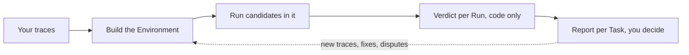
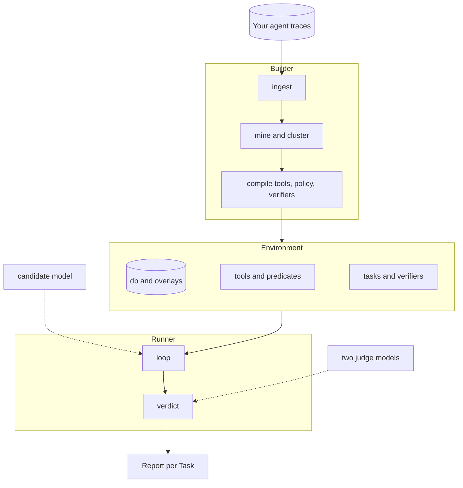

# Kullback

Kullback rebuilds the world your agent works in from the traces it already produced, checks the rebuild by replaying those traces, and runs other models through it, graded on what they changed.

The one claim I built this to earn, and haven't earned yet: a 2B parameter model post-trained in an environment Kullback built from traces performs on the real tasks. Everything below is the reconstruction work that has to hold before that experiment means anything.

It is the open-source Builder and Runner behind [Leibler](https://leibler.dev). Apache-2.0. Python 3.11.

## 1. The problem

If you run an agent in production you have a log of everything it did: the prompt, the tools it called, what they answered, what it wrote back. You pay a frontier model for every run and suspect a cheaper model could handle a good share of them. Proving that is the hard part.

The usual way is a hand-built eval: someone writes tasks, someone mocks the tools, a judge model scores transcripts, and weeks later you have numbers nobody trusts, because the mocks drift from the real system and the judge grades the wording rather than the outcome. The runs that matter most, long and multi-turn with many tool calls, are the ones a hand-built eval covers worst.

Kullback starts from the other end. Your traces already contain the tasks, the tool signatures, the data the tools returned and the effect of every write. That is enough to rebuild an executable copy of your system: a database with the rows your runs touched, one function per tool that behaves the way the real tool was observed to behave, the policy rules compiled into checks, and a simulated user who knows what the real user knew. Any model can then run the same conversations, graded on what it changed in the world, not on how it talked about it. The grader is code, so it is cheap and has no opinions, and a model that reaches the right outcome by a different route is not punished for the route.

## 2. How it works

Traces go in, an Environment comes out, candidates run in it, code grades what they changed, you read the report and decide. What you decide, plus the next week of traces, feeds the next build.



Inside that loop Kullback is two programs over one set of data records, with every model behind one interface.



The Builder reads traces and writes an Environment in six stages. Each stage is a function over records on disk, content-addressed, ending in a code gate; a stage that fails its gate hands the artifact back with the failure attached, for a bounded number of retries. A share of every Task's runs is held out from the start and never used for building.

1. Ingest stores your files unchanged and hashed and derives trace records from them. Every derived field points back to the bytes it came from. Benchmark grader fields are stripped into a sidecar that only the final comparison reads.
2. Mine recovers each tool's signature from its calls, decides whether it reads or writes (by name, then confirmed by diffing state before and after), and recovers the tables and columns behind the tools. A tool nobody can classify is flagged for a person.
3. Cluster groups runs into Tasks by the tools they write through and the similarity of their intent. Membership is decided by code; a model only names the cluster and writes a one-line intent whose every noun points at a span in a member run.
4. Compile builds the database by replaying the corpus backwards and writes one tool body per signature. A body is written by a model but must pass five gates: parses, executes on the starting state, deterministic, not a constant, reproduces held-out recorded calls. Three rewrites, then the tool is marked assisted.
5. Policy and user: the rules in the system prompt become predicates that run before every write, each with a passing and a failing test; a rule that cannot be compiled becomes a judge question and never enters a Verdict. The simulated user is written from the recorded one: facts exact, style representative.
6. Verifier derives each Task's pass condition from what the frontier model did in k re-runs: writes present in every successful re-run are required, writes present in some are allowed, anything else is forbidden. A Verifier enters the pool only after the recorded run passes it, an empty run fails it and a plausible wrong run fails it.

The Runner takes an Environment, a recorded run and a candidate model. One function advances one turn: the candidate's tool calls are routed to code first, then to an exact recording, then to a model stand-in, and the route taken is on the event. The simulated user answers from the recorded user's facts. When the run stops, Verdict is a separate code-only pass over the run's events and the Task's Verifier: required atoms present, forbidden writes absent, policy predicates never fired, the user's questions answered. A run served by a stand-in anywhere is reported and never counted.

Where a judgment call is unavoidable (two strings that may mean the same thing, a rule that could not be compiled, the cause of a failure) two agentic judges with read access to the starting and end state each cite a span and run at least one tool check. If they disagree the run goes to a person. A judge can remove a run from the bar or widen a Verifier for every candidate; it can never award a pass.

The report opens with whether the Environment was built at all (gates passed, assisted tools, Tasks with too few runs), then gives per-Task numbers and a suggestion. The decision is yours.

## 3. What has been measured

All numbers come from the offline part of the first slice, Sierra's public tau2-bench retail run (Claude 3.7 Sonnet as the agent, GPT-4.1 as the simulated user, 456 runs over 114 tasks), with no model calls anywhere. tau2 is the one place I hold the ground truth (the real `tools.py` and `db.json`), so the reconstruction can be checked exactly.

| Stage | Result on tau2 retail |
|---|---|
| Ingest | 456 runs, 3,591 tool calls, 109 errors, 0 truncated; a hand count over the raw JSON gives the same four numbers |
| Mine | 15 of 15 tool signatures match tau2's `tools.py` in both directions; the seven write tools identical; kind 13 of 15 (the two misses have no side effects); all three tables with identical columns |
| Starting state | 252 of 252 touched rows match tau2's `db.json` |
| Gate A replay | 20 seed and 10 held-out runs, 257 calls: writes 37 of 37 and 20 of 20, reads 125 of 125 and 65 of 65, errors 6 of 6 and 4 of 4, end state 33 of 33 and 17 of 17; the same in every cell against tau2's own database |
| Cluster | F1 against tau2's task ids 0.685 to 0.719 across thresholds 0.3 to 0.6 (idf-weighted token Jaccard, complete linkage, default 0.4, D100); the ceiling for any clustering by write tools is about 80% |

The same code was then run on tau2 airline and telecom with nothing retuned (`docs/cross-domain-check.md`). Airline held on ingest, signatures (14 of 14) and starting state (147 of 148), with cluster F1 0.788, but the `flights` table was never recovered because the id detector only knows `_id` suffixes, and Gate A against my database fell to 10 of 27 writes while the control against tau2's database stayed at 100%. Telecom broke: its traces interleave the simulated user's own phone tools with the agent's, the miner did not read `requestor`, so 38 tools were mined against 13 real ones, cluster F1 fell to 0.207 and 240 of 356 replayed calls had no tool to hit. Five retail-shaped assumptions are named in that file with a fix for each; the gates went red on telecom and green elsewhere, which is what they are for.

The code is 25 modules, about 14,200 lines, with about 1,200 tests that never call a model. It is larger than its design said it should be; `docs/harness-design.md` section 10 records every module against its band.

Not measured yet, because it needs a live model: the compiled tool bodies and policy predicates, the Verifier on a real Task, candidate runs, and the agreement between my Verdicts and tau2's own reward. Also not measured: any trace format other than Sierra's tau2 export. Those numbers get published whether they are good or not.

## 4. The claim

I am not claiming Kullback finds cheaper models for your runs, or that its environments are faithful, or that its verdicts agree with people. None of that has been measured beyond a reconstruction check.

The claim I intend to make is narrower and checkable: take a 2B parameter open model, post-train it on trajectories that passed the Verifier inside an environment Kullback built from traces, and it performs on the real held-out tasks, measured against the same model untrained and against the frontier model that produced the traces. The plan is in `docs/training-plan.md`. The numbers get published either way, with the environment gates beside them, so a good training number cannot hide a bad environment.

The design choices are worth reading even before that number exists: the trace is the only source of truth and every derived value points back into it; the grader is code, and a judge can only narrow the bar; every stage reports its seed number beside its held-out number; a run that needed a stand-in is reported, never counted. `docs/design-philosophy.md` says what I built, why, and what I left out. The decision log has every choice and the alternative it beat.

## 5. Next

In rough order: the end-to-end build with a live model (the orchestration that needs a model is wired but unmeasured); the five fixes from the cross-domain check; prompt caching and prompt strategy for the Builder (`docs/prompt-caching.md`); the re-run count k decided by experiment; more trace formats on ingest (Langfuse, OpenTelemetry GenAI, OpenInference, LangSmith, plain OpenAI and Anthropic logs, and the public benchmark formats); synthetic Tasks and data from the environment; the post-training experiment; an OpenEnv wrapper over the loop. `docs/todo.md` has the full list with the reasoning.

## Getting started

```
uv sync
uv run pytest
uv run harness ingest path/to/traces.json --workdir work
```

Live model calls need `HARNESS_ALLOW_MODEL_REQUESTS=1` and an API key, both read from the environment or from a `.env` file in the working directory. `CONTRIBUTING.md` says how to get a change in. `DEVELOPING.md` covers the layout, the records, the offline test models and the fixtures. `docs/harness-design.md` is the spec; `docs/decision-log.md` is why.
