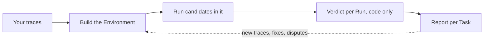
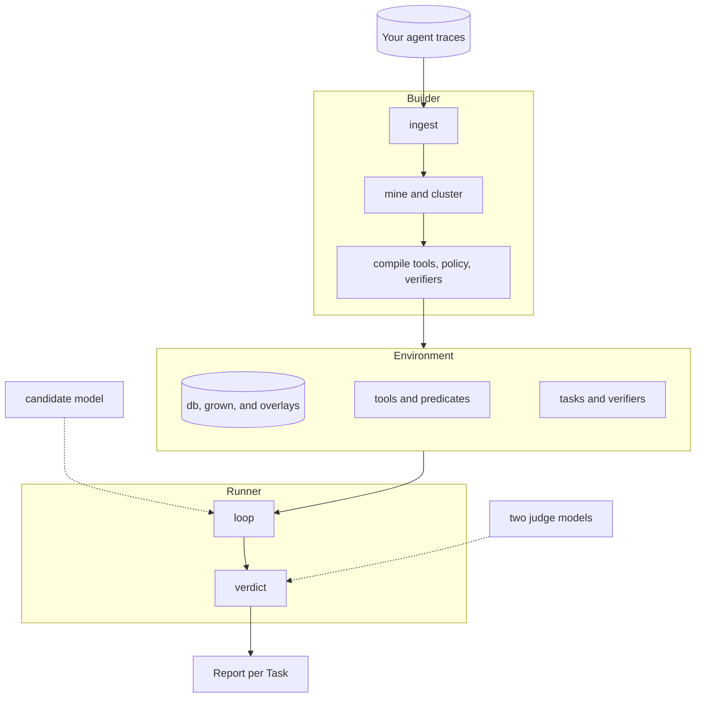

# Kullback

Kullback rebuilds the world your agent works in from the traces it already produced, checks the rebuild by replaying those traces, grows the rebuilt database with synthetic rows shaped by the real ones, and runs other models through it, graded on what they changed.

It is the open-source Builder and Runner behind [Leibler](https://leibler.dev). Apache-2.0. Python 3.11.

## 1. The problem

If you run an agent in production you have a log of everything it did: the prompt, the tools it called, what they answered, what it wrote back. You pay a frontier model for every run and suspect a cheaper model, or a small model trained on your own runs, could handle a good share of them. Proving that is the hard part.

The usual way is a hand-built eval: someone writes tasks, someone mocks the tools, a judge model scores transcripts, and weeks later you have numbers nobody trusts, because the mocks drift from the real system and the judge grades the wording rather than the outcome. The runs that matter most, long and multi-turn with many tool calls, are the ones a hand-built eval covers worst. And a hand-built eval only ever covers the rows and paths someone thought to mock, so a model that wanders one step off the recorded path meets an empty world.

Kullback starts from the other end. Your traces already contain the tasks, the tool signatures, the data the tools returned and the effect of every write. That is enough to rebuild an executable copy of your system: a database with the rows your runs touched, one function per tool that behaves the way the real tool was observed to behave, the policy rules compiled into checks, and a simulated user who knows what the real user knew. The rows the traces did show are then the evidence for the rows they did not: the database is grown to the size of the real one with synthetic users, orders and the rest, composed by structural rules read off the observed rows (which field is a key to which table, which list repeats which row, which total is a sum of which lines), tagged so nothing built on them is ever mistaken for the real thing. Any model can then run the same conversations in that world, graded on what it changed, not on how it talked about it. The grader is code, so it is cheap and has no opinions, and a model that reaches the right outcome by a different route is not punished for the route.

The same environment is where a small model gets its training data: trajectories that pass the Verifier inside a world rebuilt from your traces. What that is worth is measured, not assumed; every number is published beside the environment gates that produced it, so a good training number cannot hide a bad environment.

## 2. How it works

Traces go in, an Environment comes out, candidates run in it, code grades what they changed, you read the report and decide. What you decide, plus the next week of traces, feeds the next build.



Inside that loop Kullback is two programs over one set of data records, with every model behind one interface.



The Builder reads traces and writes an Environment in stages. Each stage is a function over records on disk, content-addressed, ending in a code gate; a stage that fails its gate hands the artifact back with the failure attached, for a bounded number of retries. A share of every Task's runs is held out from the start and never used for building.

1. Ingest stores your files unchanged and hashed and derives trace records from them. Every derived field points back to the bytes it came from. Benchmark grader fields are stripped into a sidecar that only the final comparison reads.
2. Mine recovers each tool's signature from its calls, decides whether it reads or writes (by name, then confirmed by diffing state before and after), and recovers the tables and columns behind the tools, including where one table's rows live inside another's. A tool nobody can classify is flagged for a person.
3. Cluster groups runs into Tasks by the tools they write through and the similarity of their intent. Membership is decided by code; a model only names the cluster and writes a one-line intent whose every noun points at a span in a member run.
4. Starting state builds the database by replaying the corpus backwards, then grows it on request (`--grow users=500`) with synthetic rows composed from the observed ones, checked for key closure, id shape and duplication, and tagged so a run that reads one is reported as assisted.
5. Compile writes one tool body per signature. A body is written by a model but must pass five gates: parses, executes on the starting state, deterministic, not a constant, reproduces held-out recorded calls. Three rewrites, then the tool is marked assisted.
6. Policy and user: the rules in the system prompt become predicates that run before every write, each with a passing and a failing test; a rule that cannot be compiled becomes a judge question and never enters a Verdict. The simulated user is written from the recorded one: facts exact, style representative.
7. Reference and Verifier: every trace is replayed through the built tools with its own assistant and user turns, and a trace whose writes all match and whose reads never differ in substance is a confirmed Reference. The Verifier derives each Task's pass condition from its confirmed References: writes present in every successful re-run are required, writes present in some are allowed, anything else is forbidden. A Verifier enters the pool only after the recorded run passes it, an empty run fails it and a plausible wrong run fails it.

The Runner takes an Environment, a recorded run and a candidate model. One function advances one turn: the candidate's tool calls are routed to code first, then to an exact recording, then to a model stand-in, and the route taken is on the event. The simulated user answers from the recorded user's facts. When the run stops, Verdict is a separate code-only pass over the run's events and the Task's Verifier: required atoms present, forbidden writes absent, policy predicates never fired, the user's questions answered. A run served by a stand-in anywhere, or that read a synthetic row, is reported and never counted.

Where a judgment call is unavoidable (two strings that may mean the same thing, a rule that could not be compiled, the cause of a failure) two agentic judges with read access to the starting and end state each cite a span and run at least one tool check. If they disagree the run goes to a person. A judge can remove a run from the bar or widen a Verifier for every candidate; it can never award a pass.

The report opens with whether the Environment was built at all (gates passed, assisted tools, Tasks with too few runs), then gives per-Task numbers and a suggestion.

## 3. Next

In rough order: the live build measured against the real system on every domain we hold the ground truth for (`docs/live-build.md` has the first, with the misses split by cause); synthetic Tasks on top of the synthetic rows, so an environment holds more than the paths the traces walked; a UI that talks to the Builder and Runner underneath, beyond the terminal screen that exists today; more trace formats on ingest; the post-training experiment: a small open model trained on trajectories that passed the Verifier, measured on the real held-out tasks against the same model untrained and against the frontier model that produced the traces; an OpenEnv wrapper over the loop. `docs/todo.md` has the full list with the reasoning, `docs/decision-log.md` every choice and the alternative it beat, and `docs/design-philosophy.md` what was built, why, and what was left out.

## Getting started

```
uv sync
uv run pytest
uv run kullback ingest path/to/traces.json --workdir work
uv run kullback build --workdir work --model provider/model --grow users=500 --grow orders=1000
```

Live model calls need `HARNESS_ALLOW_MODEL_REQUESTS=1` and an API key, both read from the environment or from a `.env` file in the working directory. `CONTRIBUTING.md` says how to get a change in. `DEVELOPING.md` covers the layout, the records, the offline test models and the fixtures. `docs/harness-design.md` is the spec; `docs/decision-log.md` is why.
