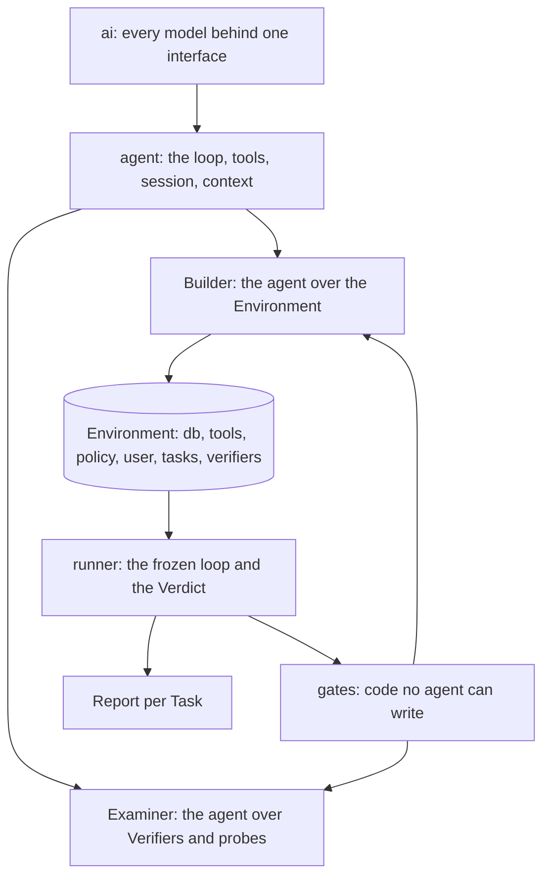

# Kullback

Kullback is the way to find out how well a model performs in your own environment, and then to train one on it. It rebuilds the world your agent works in from the traces it already produced, checks the rebuild by replaying those traces, grows the rebuilt database with synthetic rows shaped by the real ones, and runs other models through it, graded on what they changed. The runs that pass are the training data for the next model.

It is the open-source Builder and Runner behind [Leibler](https://leibler.dev). Apache-2.0.

## The problem

You run an agent in production and pay a frontier model for every run. You suspect a cheaper model, or a small model trained on your own runs, could handle a good share of them. Proving that is the hard part. A hand-built eval takes weeks and produces numbers nobody trusts: the mocked tools drift from the real system, a judge model grades the wording rather than the outcome, and a model that steps one row off the recorded path meets an empty world.

Your traces already hold the tasks, the tool signatures, what the tools returned and the effect of every write. That is enough to rebuild an executable copy of your system and grade any model on what it changed in it. The grader is code, so it is cheap and has no opinions.

## How it works

Traces go in, an Environment comes out, candidates run in it, code grades what they changed, you read the report. Two agents, one runner and one set of gates, on a layering inspired by [huggingface/tau](https://github.com/huggingface/tau).



The Builder turns traces into an Environment: a database with the rows your runs touched, one function per tool that behaves as the real tool was observed to behave, the policy rules compiled into checks that run before every write, a simulated user who knows what the real user knew, and a Verifier per Task derived from the recorded runs. Every stage ends in a code gate; a model writes a tool body, five gates judge it. The database is grown with synthetic rows composed by rules read off the observed ones and tagged, so nothing built on them is mistaken for the real thing.

The Runner takes an Environment, a recorded run and a candidate model, and advances one turn at a time: tool calls go to code first, then to an exact recording, then to a model stand-in, and the route taken is on the event. When the run stops, the Verdict is a code-only pass over what changed: required writes present, forbidden writes absent, policy never broken, the user's questions answered. A run served by a stand-in anywhere is reported and never counted. Where a judgment call is unavoidable, two judges each cite a span, and a disagreement goes to a person; a judge can never award a pass.

The gates are the part no model may touch. They run on every artifact the Builder makes, the Runner is frozen once a person confirms it, and every Verdict carries the hash of both.

```
kullback/
  ai/         models, the provider stream, pricing
  agent/      the agent core: loop, tools, session, context
  builder/    the Environment agent
  examiner/   the Verifier and probe agent (phase 5)
  runner/     the frozen loop and the Verdict; serves both agents
  gates/      every accept-or-reject check; serves both agents, no model call
  cli.py      the command line
  tui/        the terminal screen
  report.py   the customer-facing report
```

## How to use it

```
uv sync
uv run kullback ingest path/to/traces.json --workdir work
uv run kullback build --workdir work --model provider/model --grow users=500 --workers 8
uv run kullback freeze-runner --workdir work
uv run kullback run --workdir work --task <task id> --model provider/candidate --count 3
uv run kullback verdict --workdir work
uv run kullback report --workdir work
```

`kullback tui` shows the build as it runs. `build --iterate` resumes from the cache, `--target` builds one stage and what it needs, `--agent` lets the model drive the Builder. Live model calls need `HARNESS_ALLOW_MODEL_REQUESTS=1` and an API key, from the environment or a `.env` in the working directory.

The report opens with whether the Environment was built at all (gates passed, assisted tools, Tasks with too few runs), then gives per-Task numbers and a suggestion.

`CONTRIBUTING.md` says how to get a change in. `DEVELOPING.md` covers the records, the offline models and the fixtures. `docs/architecture.md` is the map, `docs/harness-design.md` is the spec, `docs/decision-log.md` and `docs/adr/` are why, `docs/todo.md` is what comes next.

## Citation

Related work by the same author, cited here because the Harness is meant to run against models people train themselves, not only against hosted ones.

```bibtex
@misc{hindi-modernbert2026,
  title  = {hindi-modernBERT: A Hindi ModernBERT Encoder with 8192 Context},
  author = {Krrish Agarwalla},
  year   = {2026},
  note   = {Checkpoint ba1157. Base MLM; trained from scratch on Hindi.}
}
```
