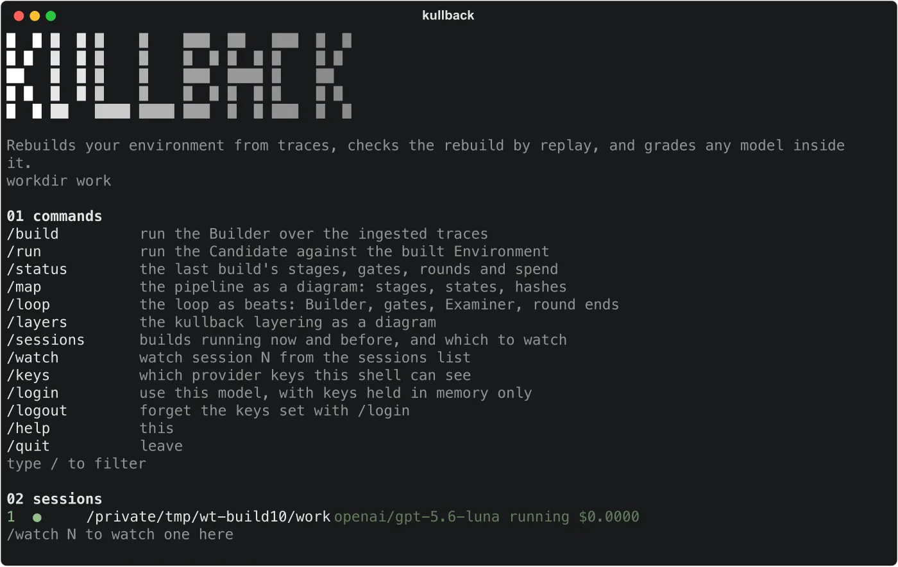

<div align="center">
  <h1>Kullback</h1>
  <p><strong>Rebuild an executable environment from your agent's traces, then grade and train models on it.</strong></p>
  <p>
    <a href="https://huggingface.co/leibler"><strong>Environments on Hugging Face</strong></a> ·
    <a href="#quick-start"><strong>Quick start</strong></a> ·
    <a href="#commands"><strong>Commands</strong></a> ·
    <a href="docs/architecture.md"><strong>Architecture</strong></a>
  </p>

  <a href="LICENSE"></a>
  <a href="https://www.python.org"></a>
  <a href="https://huggingface.co/leibler"></a>

  <br><br>
  
</div>

Your traces already hold the tasks, the tool signatures, what the tools returned and the effect of every write. That is enough to rebuild a copy of your system that runs, and to grade any model on what it changed in that copy. The grader is code, so it is cheap and has no opinions.

Kullback is the open-source Builder and Runner behind [Leibler](https://leibler.dev), under Apache-2.0. It is under active development: the numbers below move every build round, and the interfaces can still change.

## News

- **2026-09-09.** The first three Environments are on Hugging Face under [leibler](https://huggingface.co/leibler). Retail is a release, airline and telecom are previews. New commands `export`, `publish` and `fetch` move an Environment between a build and the Hub, and every package carries a leak scan and a content hash.
- **Next.** Raise the trusted Task count on each Environment, then generate Tasks synthetically over the rebuilt world on top of the recorded ones.

## Environments on Hugging Face

| Environment | Replay fidelity | Trusted Tasks | Round | Status |
| --- | --- | --- | --- | --- |
| [leibler/retail](https://huggingface.co/datasets/leibler/retail) | 95.1% | 122 of 205 | 1 | release |
| [leibler/airline](https://huggingface.co/datasets/leibler/airline) | 72.3% | 38 of 119 | 3 | preview |
| [leibler/telecom](https://huggingface.co/datasets/leibler/telecom) | 9.3% | 0 of 183 | 5 | preview |

A release replays at least 90% of its Tasks. A preview is below that bar and is published anyway, with its numbers on its card, so the work stays visible while it improves. All three come from the public [tau2-bench](https://github.com/sierra-research/tau2-bench) corpora (MIT). A package holds the rebuilt world, the Task list and the Verifiers, and none of the recordings it was built from.

```bash
uv run kullback fetch leibler/retail --out env-retail
uv run kullback run --workdir env-retail --task <task id> --model provider/model
uv run kullback verdict --workdir env-retail
uv run kullback report --workdir env-retail
```

`fetch` checks every file against the package's content hash and refuses one that does not match. `--revision round-<n>` fetches an earlier round. To publish a build of your own, see `docs/hf/environment-card-template.md`.

## Quick start

```bash
uv sync
uv run kullback ingest path/to/traces.json --workdir work
uv run kullback build --workdir work --model provider/model --grow users=500 --workers 8
uv run kullback freeze-runner --workdir work --yes
uv run kullback run --workdir work --task <task id> --model provider/candidate --count 3
uv run kullback verdict --workdir work
uv run kullback report --workdir work
```

`kullback tui` shows a build as it runs: stages, gates, rounds and spend. Live model calls need `HARNESS_ALLOW_MODEL_REQUESTS=1` and an API key, from the environment or a `.env` in the working directory (see `.env.example`). Any `provider/model` id resolves through the built-in adapters or the models.dev registry.

## What it does

The Builder turns traces into an Environment: a database with the rows your runs touched, one function per tool that behaves as the real tool was observed to behave, the policy compiled into checks that run before every write, a simulated user who knows what the real user knew, and a Verifier per Task derived from the recorded runs. A model writes each piece and code gates judge it.

The Runner takes an Environment and a candidate model and advances one turn at a time. Tool calls go to code first, then to an exact recording, then to a model stand-in, and the route taken is on the event. A Run served by a stand-in is reported and never counted. The Verdict is code over what changed. The Runner is frozen once a person confirms it, and every Verdict carries the hash of the Runner and the gates.

The full map, package by package, is in [docs/architecture.md](docs/architecture.md).

## Commands

| Command | What it does |
| --- | --- |
| `ingest FILES --workdir` | Load trace exports into the workdir |
| `build --workdir --model` | Build the Environment (`--iterate` resumes, `--target` builds one stage, `--agent` lets the model drive) |
| `freeze-runner --workdir` | Freeze the Runner on a person's confirmation |
| `run --workdir --task --model` | Run a candidate (`--count`, `--seed` for batches) |
| `verdict --workdir` | Code-only Verdict over what changed |
| `regrade --workdir` | Re-score stored Runs against a new Verifier |
| `report --workdir` | The report (`--out`, `--batch`) |
| `export --workdir --out` | Write a self-contained Environment package with a manifest and a leak scan |
| `publish --workdir --repo` | Export, write the dataset card and upload it, tagged with its round (`--preview` below the fidelity bar) |
| `fetch REPO --out` | Download a published Environment, verify its hash and lay it out as a workdir |
| `tui --workdir` | The terminal screen over a live build |

## Read more

- [docs/architecture.md](docs/architecture.md), the map
- [docs/harness-design.md](docs/harness-design.md), the spec
- [docs/decision-log.md](docs/decision-log.md), why
- [docs/todo.md](docs/todo.md), what comes next
- [CONTRIBUTING.md](CONTRIBUTING.md) and [DEVELOPING.md](DEVELOPING.md)

## Citation

```bibtex
@misc{kullback2026,
  title  = {Kullback: Executable Environments and Verifiers Rebuilt from Agent Traces},
  author = {Krrish Agarwalla},
  year   = {2026},
  note   = {Open-source Builder and Runner behind Leibler. https://github.com/leiblerdev/kullback}
}
```
