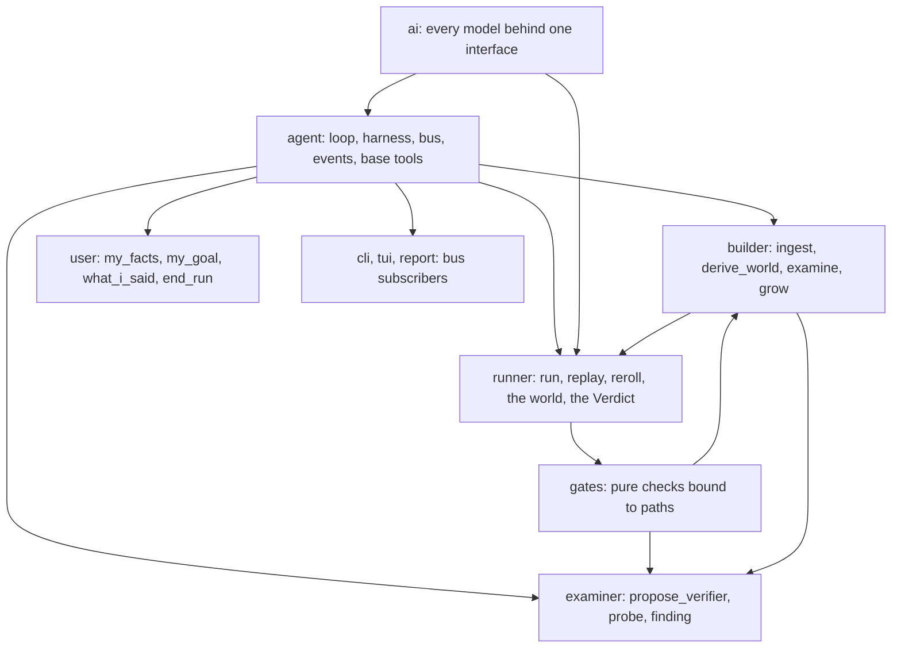
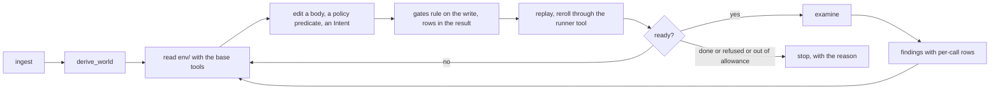
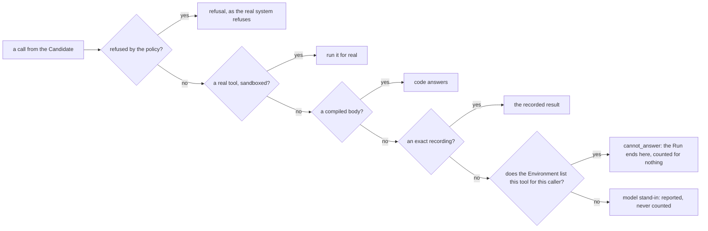

# Architecture

Kullback is one provider layer, one agent core, and domain environments as extensions of that core, a layering taken from [huggingface/tau](https://github.com/huggingface/tau). The domain environments are what makes Kullback Kullback; the core knows nothing about them. This page is the map. The decision is ADR-0011, the decisions behind it are in `decision-log.md` and `adr/`, and `overhaul/learnings-ledger.md` says where every earlier learning lives now.

The rebuild runs in eight streams and this page marks what is not yet built with "(stream N, pending)": 1 this page and the ledger, 2 the core, 3 the runner, 4 the gates, 5 the Builder, 6 the Examiner, 7 the Simulated user, 8 the first build.

## The shape

Traces go in, an Environment comes out, candidates run in it, code grades what they changed, you read the report.

```
kullback/ai         providers, request shaping, neutral streaming of text, thinking and tool calls, usage, pricing
kullback/agent      the loop, the harness (transcript, state, cancel, steer and follow-up queues), typed events,
                    one bus, session recording and resume, compaction, and the base tools: read, write, edit,
                    bash, grep, find, ls, web_search
kullback/builder    extension: domain tools ingest, derive_world, examine, grow; prompt sections, skills,
                    templates; registers the base tools over its root env/ with its shell allowlist
kullback/examiner   extension: domain tools propose_verifier, probe, finding; registers read, write, edit, grep,
                    find, ls, web_search over its root exam/ (no bash)
kullback/user       extension: my_facts, my_goal, what_i_said, end_run; no base tools at all
kullback/runner     a tool, not an agent: run(environment, task, model), replay(task), reroll(task); inside it
                    the world (in-memory tables, loading from rows and overlays, laws), the route order, the Run
                    as JSONL, the code-only Verdict, and a version hash of its own code plus the core loop
kullback/gates      pure checks bound to paths; one tool_result hook appends the ruling, with the rows that
                    still differ, to the tool result
kullback/cli, tui   subscribers of the bus
```



Each package imports only what sits below it, and an import-linter contract in the pre-commit hook enforces the direction. The extensions import the core, the runner and the gates; the gates import the runner and never the core; the runner and the core import `ai`; nothing imports the frontends. The Simulated user never imports the Builder or the Examiner, because they derive its vocabulary and drive its Runs.

## The agent core (stream 2, pending)

The loop is a function: it takes a state, a model and a tool registry, and returns when the model stops. The harness owns the transcript, the tool registry, two queues (steer, delivered after the current tool batch; follow-up, delivered when the run would otherwise stop), cancellation and the subscribers. Hooks run before a tool call (a raising hook blocks it) and after a tool result (a hook may rewrite the result, which is where a gate ruling is appended). Every message is recorded in a session so a run can be resumed. Compaction mirrors tau: automatic at 40 percent of the context window, manual on request, the older prefix summarised and recent turns kept verbatim. There are no `forget`, `recall`, `load` or `unload` tools.

The base tools live in the core and are registered by an extension over that extension's root: read, write, edit, bash, grep, find, ls, web_search.

## The bus (stream 2, pending)

One bus per workdir, `bus.jsonl`: append-only, sequence-numbered, typed. Every harness and every tool publishes to it, and every consumer subscribes: the tui, the journal, the feed, the report, the Examiner's finding collector. Transcripts stay per agent, because a transcript is context and not an event. There is no second event stream and no round journal.

## Boundaries

Two levels only.

Cannot: the tool is not registered for that extension. The Simulated user has no file tools at all. The Examiner has no bash; its writes under exam/ are gated. No agent has a tool that reaches the gates, the runner, the held-out Traces or the Verifiers, because those live in the workdir outside every agent's root.

Should not: stated in the extension's prompt, where a rule is a matter of judgement rather than of access.

The shell is the one tool that is many tools, so bash takes an allowlist of commands and a cwd, checked once inside the tool. A command that is not on the list, an absolute path, or a step into a parent directory is refused, and the refusal is an ordinary tool result the agent can read.

## Gates bound to paths (stream 4, pending)

A gate is a pure function over an artifact that returns a ruling, and it contains no model call. Gates are bound to the path that was written: a write under `env/tools/` runs the body gates (executes on the starting state, sensitivity, non-triviality, the render round trip, keep-by-beating, the effect check), a write under `exam/verifiers/` runs the Verifier gates (the D79 suite, monotone probes, one-directional loosening). One `tool_result` hook in the core appends the ruling to the tool result, so an agent sees the ruling with the artifact and cannot skip, edit or bypass it.

Every ruling carries the rows that still differ, recorded against ours, per call. Not a count, not a gate word. This is the single change the live rounds of 2026-09-22 asked for (`learnings.md` section 7).

## The Builder (stream 5, pending)

The Builder is autonomous. There is no scheduler and no round.



It ingests the recordings, derives the world from them, reads and edits its Environment under `env/` with the base tools, runs replay and reroll through the runner tool, calls examine when it judges the Environment ready, acts on the findings, and stops when every Task is trusted or refused with a reason, when the spend hook says the allowance is gone, or when it states why it cannot go further.

The Builder never writes world rows. Rows are derived by code from the recordings (derive_world, carrying mine, readers, cluster, canon and the starting state). It may grow a table with synthetic rows, never in a trusted Task, and it may file a data finding. It never writes Verifiers, probes, gates or the runner.

## The Examiner (stream 6, pending)

The Examiner derives each Task's Verifier from the Intent and the frontier's re-rolls, writes probes against it, edits it when a gate rejects it, and the gates rule on the write. It refuses a Task no frontier Run finishes, and returns findings to the Builder that carry the rows that differ. It reads and writes with read, write, edit, grep, find, ls and web_search over `exam/`, and it has no bash. It never reads a tool body and never edits the Environment (ADR-0007).

## The Simulated user (stream 7, pending)

The person on the other end of the conversation is an agent too, on the same core, with four tools of its own and no base tools. Underneath sits the rule-driven user read off one recording: the facts that user gave, exact, typed askable or record, when it gives each of them, how it refuses, and the protocol that decides which of four kinds a Run ended in. On top of that sits a model with a context curated per Task from the recording alone: the typed facts, the goal in the recorded user's own words, a persona stored as counted classes rather than quotes, the values this user chooses when asked to choose, the conversation so far, and the lessons the last round left. Its tools read only what a person on the phone can see, never the Environment's tables. After the model, code guards every turn: a value-shaped token that is not one of this user's own facts drops the turn, a record fact is replaced by the sentence that points at it, and a turn that volunteers more than the recorded user had volunteered by the same point is cut back. The end is decided in code; the model may only ask for one.

Which driver speaks is measured rather than assumed. Each Task's two drivers are scored offline against the recorded turns on carrying the same facts, adding none, speaking no record fact and ending the same way; the model drives the Tasks where it beats the rules and the rules drive the rest, and on every Task the rules answer any turn a guard drops. The score names what went wrong per Task, that becomes the next lesson, and a Task the model has not beaten after three rounds of lessons stops paying for it until its facts or persona change.

## The runner as a tool (stream 3, pending)

The runner is a tool, not an agent, with three calls: `run(environment, task, model)`, `replay(task)` and `reroll(task)`. Inside it are the world (in-memory tables loaded from rows and overlays, with the consistency laws), the route, the Run written as JSONL, and the code-only Verdict. The candidate inside a Run is an agent on the core with only the Environment's tools registered, and the Simulated user is an agent on the core.



The route taken is on the event and in the Run. A Run served by a stand-in is reported and never counted, and a training Run never uses the stand-in at all.

A version hash of the runner's own code plus the core loop it ran on is stored beside every Verdict. With one loop, a change in the core can change a Verdict, so the hash is what the freeze used to be: a Verdict always names the code that produced it, and two Verdicts are comparable only when the hash matches.

## On disk

```
workdir/
  env/            the Builder's root: tables, tools/ (the bodies), policy, intents, the simulated user
  exam/           the Examiner's root: verifiers/, probes/, findings
  holdout/        held-out Traces and Runs, outside every agent's root
  runs/           every Run as JSONL, with its Verdict and the version hash beside it
  bus.jsonl       the one bus: append-only, sequence-numbered, typed
```

The raw recordings are kept byte for byte and content-hashed, and everything derived points back to the bytes it came from. The gates, the Verifiers, the held-out Traces and the runner live outside every agent's root, which is what makes "cannot" a boundary rather than a rule.

## The first build (stream 8, pending)

The first build on the new shape is one corpus end to end: ingest, derive_world, the Builder's own loop against the gates, examine, and a Verdict per Task with its version hash. What it has to show is that a body moves when a ruling names the rows that differ, which is the one thing the rounds of 2026-09-22 could not.
