# Architecture

This page describes the code under `kullback/` as it is on the branch that carries it. It covers the package boundaries and the import contracts that enforce them, how a build runs from traces to a published Environment, and what is frozen. Every module has one row on [the module page](architecture/modules.md).

The reasons for this shape live in other files, and this page links to them without repeating them: [decision-log.md](decision-log.md) holds the numbered decisions (D numbers), [learnings.md](learnings.md) holds what the builds taught, and [adr/](adr/) holds the architecture decisions, ADR-0007 (two agents and gates no agent can write) and ADR-0011 (one core, one bus, an autonomous Builder) among them.

## Packages

Kullback is a provider layer (`ai`), a shared agent core (`agent`), three agents that sit on that core as extensions (`builder`, `examiner`, `user`), the Runner that executes and grades a Run (`runner`), the gates that rule on what the agents write (`gates`), and publishing (`hub`). Three frontends read the results: `cli`, `tui` and `report`. Fourteen top-level modules sit beside the packages.

| Package | What it owns | Imports today |
|---|---|---|
| `ai` | Every model behind one `ModelProvider` contract: request shaping, SSE streaming into canonical events, retries, prompt caching, pricing from a models.dev snapshot, token usage. It also holds the replay handles (`MemoModel`, `RecordedModel`, `TestModel`) that make a Run reproducible without a live call. | nothing of ours |
| `agent` | The application-free core, shaped after tau_agent: the stateless loop, the harness that holds transcript, tools, queues and hooks, typed events, the per-workdir bus, the session tree, compaction, skills and the base tools bound to a root. An application attaches through `setup(api)` extensions. | `ai` |
| `runner` | Executes a Run and decides its Verdict in code: the records every module passes around, the canonicalizer, routing a tool call (real, code, recording, stand-in), replay, the judge, budget accounting, and the `world` subpackage that loads a built Environment for anyone to step through. The agents call it as a tool (`runner/tool.py`); it is not an agent itself. | `ai`, `gates`, `laws`, `sampling` |
| `gates` | Every accept-or-reject check over what an agent made, as plain code with no model call: artifact gates, tool-run rulings, replay fidelity, the D79 Verifier suite, loosening, probes, trust and refusal. Gates are bound to paths and run through one `tool_result` hook, and they record into `gates.json` through one ledger. | `runner` |
| `user` | The Simulated user, as a rule-driven user (`SimulatedUser`) and as a model-driven agent (`AgentUser`) with code guards after every turn. It also owns the curated per-Task context, the vocabulary shape, user fidelity scoring and the lessons that feed the next round. | `agent`, `ai`, `gates`, `runner`, `sampling` |
| `examiner` | Derives one Verifier per Task from the Builder's References, probes it, repairs and loosens it under the gates, refuses unsolvable Tasks and files findings for the Builder. The Builder calls it through `examine`. | `agent`, `gates`, `runner`, `user` |
| `builder` | Turns traces into an Environment: ingest through format adapters, mine tools and schema, cluster Tasks, write Intents, build the Starting state, write and repair each tool body in a sandbox, and drive the whole thing as one autonomous session. | `agent`, `ai`, `examiner`, `gates`, `runner`, `user` |
| `hub` | Exports a workdir as a self-contained Environment package with a manifest and leak scan, renders its cards, and publishes it to or fetches it from a dataset host. | `builder`, `gates`, `runner`, `difficulty`, `domain` |
| `report` | Renders the Markdown report from records on disk; it never computes a Verdict. | `examiner`, `runner`, `user`, `claims`, `difficulty`, `round_snapshot` |
| `tui` | The terminal screen that shows one build while it runs. | `agent`, `ai`, `builder`, `runner` |
| `cli.py` | The `kullback` command (`[project.scripts]`), one subcommand per entry point, each importing its module lazily. | `ai`, `builder`, `gates`, `graph`, `report`, `runner`, and more lazily |

The top-level modules (`claims`, `consistency`, `container_*`, `difficulty`, `domain`, `graph`, `laws`, `round_snapshot`, `sampling`, `store`, `store_specs`, `synthesise`) are not named in any contract. `runner` reads `laws` and `sampling`, `user` reads `sampling`, and the rest are read by `cli`, `report`, `hub` and each other. `synthesise` and `domain` reach into `builder` and `examiner`, so they sit above them in practice even though no contract says so.

## Import contracts

import-linter enforces five contracts from `[tool.importlinter]` in `pyproject.toml` (root package `kullback`); the pre-commit hook runs it. The names and module lists below are copied from that file.

The first is a layers contract, `the Builder sits on the Examiner, both on the user, the agent core, the Runner and the gates, on the provider layer`, over the container `kullback`, with the layers top to bottom:

```
hub
builder
examiner
user
agent
runner:gates
ai
```

A module may import from a layer below its own and never from one above. `runner:gates` is one layer of two siblings that may import each other, because the world executes built toolkits under the confinement gate while the gates grade the Runner's records. The contract allows `agent` to import `runner` and `gates`; it does not, by discipline.

The other four are forbidden contracts.

| Name | Source modules | Forbidden modules |
|---|---|---|
| `the world inside the runner imports neither builder, examiner nor user` | `kullback.runner.world` | `kullback.builder`, `kullback.examiner`, `kullback.user` |
| `the Simulated user never imports the two agents that drive it` | `kullback.user` | `kullback.builder`, `kullback.examiner` |
| `gates rules on the Runner's work; it never reaches into the agent core` | `kullback.gates` | `kullback.agent` |
| `nothing imports the frontends except themselves` | `kullback.ai`, `kullback.agent`, `kullback.runner`, `kullback.gates`, `kullback.user`, `kullback.builder`, `kullback.examiner` | `kullback.cli`, `kullback.tui`, `kullback.report` |

The layers contract already implies the first three. They are stated anyway because, as the comment above the contracts in `pyproject.toml` says, a layers contract alone lets a cycle in through a module the layer list does not name. The last one leaves `hub` out of its sources, so only convention keeps `hub` off the frontends.

A second, stricter boundary is not import-linter's: `runner/boundary.py` scans `runner/` and `ai/` with an AST pass and refuses any import of the Builder and any dynamic import primitive (D89, D91). It also scans `examiner/derive.py`, which may read only the `records` and `canon` modules of the Runner.

## How a build runs

```mermaid
flowchart LR
    A[customer export] -->|kullback ingest| B[raw/ traces/ grader/]
    B -->|kullback build| C[derive_world: mine, readers, cluster, canon, Starting state]
    C --> D[tool bodies in env/tools, sandbox and gates]
    D --> E[replay and fidelity]
    E -->|examine| F[Examiner: References, Verifiers, probes]
    F --> G[trust and refuse gates, findings]
    G -->|repairs| D
    G --> H[runner Runs: kullback run, verdict, regrade]
    H -->|kullback export, publish| I[Environment package on the Hub]
```

A build lives in one workdir. Each stage below names its entry point and the records it leaves. The single-file records are declared once in `kullback/store_specs.py`, with the stage that owns each; per-Task, per-Run and per-round families (`traces/`, `runs/`, `verifiers/`, `overlays/`, `rounds/<n>/`) live in directories beside them.



1. Ingest. `kullback ingest` (or `kullback build --file`) calls `builder/ingest.py`, which asks each adapter in `builder/sources/` whether a file is its format. The file is stored byte for byte under `raw/<hash>.json`, Traces are derived into `traces/`, grader fields go to a `grader/` sidecar, and the ruling to `intake_ruling.json`. `kullback rescue` attaches task definitions from a registry to recordings that name a task id.
2. Derive the world. `kullback build` runs `builder/session.py:build`, one autonomous session on the agent core with the Builder extension over its root `env/`. Its first tool, `derive_world` (`builder/world_tools.py`), runs the mine, readers, cluster, canon rules and Starting state steps. They write `tool_sigs.json`, `unknown_tools.json`, `row_homes.json`, `world_constants.json`, `schema.json`, `readers.json`, `tasks.json` with one file per Task under `tasks/`, `task_split.json`, `grouping.json`, `tasks_frozen.json`, `canon-rules.json`, `db.json`, `assumptions.json`, `world_provenance.json`, `anchor.json`, `evidence_counts.json` and the per-Task `overlays/`. The last step writes one Simulated user rules file per Trace to `user_rules/<trace_id>.json`, read off its user turns by code (D44). It reads `vocabulary.json` where the build has one and falls back to the generic core where it does not; the world step writes neither `vocabulary.json` nor `user_facts.json`.
3. Write tools and bodies. `env_files.explode` lays out one file per tool under `env/tools/`, and the model edits them with the base tools. Every write passes the path-bound gates through `gates/hook.py`: confinement first, then the sandbox runs (`builder/sandbox.py`, rulings in `gates/tool_runs.py`). Bodies and outcomes land in `bodies.json`, `tool_builds.json`, `tool_call_outcomes.json` and `tool_fidelity.json`, and every ruling in `gates.json`. Policy sentences compile into `constraints.json` and `policy.json`.
4. Replay and fidelity. The `replay` tool runs `runner/tool.py:replay_all`, which replays each recorded Trace through the rebuilt Environment (`runner/replay.py`). Results go to `replays.json`, `runs.json`, `replay_evidence.json`, `write_effects.json` and `holdout_answers.json`, with Runs as JSONL under `runs/`. `gates/fidelity.py` holds the bar. A repair lands only as a transaction that fixed its target and regressed nothing (`builder/transaction.py`).
5. The Examiner. The `examine` tool calls `examiner/session.py:examine`. It picks References (`examiner/reference.py`), derives Verifiers into `verifiers/` (`examiner/stage.py`, `examiner/derive.py`), runs probes, re-rolls and variants through the runner tool, and files findings. It writes `references.json`, `task_status.json`, `constraints_check.json`, and under `examiner/` it writes `findings.json`, `refusals.json`, `rerolls.json` and `auto_loosen.json`. The Examiner reads only what `exam_files.expose` copies into `exam/`.
6. Gates and trust. `gates/verifier_suite.py` runs the D79 checks, `gates/loosening.py` and `gates/probes.py` hold loosening one-directional and the probe pool monotone, and `gates/trust.py` decides trusted and refused. The session stops when every Task is trusted or refused, when the spend ceiling in `budget.json` is reached, or when the model states why it cannot go on. Each closed round writes its Task table once to `rounds/<n>/tasks.json` (`round_snapshot.py`), and `kullback status` compares the live files against it.
7. Runs. `kullback run` drives a Candidate through `runner/tool.py:reroll`, one JSONL per Run under `runs/`, with the Simulated user built by `user/factory.py`. `kullback verdict` scores stored Runs on their End state and `kullback regrade` re-scores them against a newer Verifier or Environment without re-running (`runner/regrade.py`). `kullback solve-rate`, `consistency`, `difficulty`, `synthesise`, `read-domain` and `user fidelity` measure the built Environment from other sides; `kullback report` writes the Markdown report.
8. Export and publish. `kullback export` writes the package (`hub/package.py`): the rebuilt world, Task list, Verifiers and a manifest, after a leak scan. `kullback publish` uploads it as one commit tagged with its round or `build-<YYYYMMDD>` (for example build-20260924), and `kullback fetch` brings one back and checks its content hash.

Across all of it, the core appends every event to `bus.jsonl`, the Builder's transcript lives in `sessions/builder.jsonl`, and priced calls stream to the feed (`runner/feed.py`) that `kullback tui` and `kullback budget cache` read.

## What is frozen

The Runner and the gates are the two things no agent may change during a build, because they decide what a Run did and whether an artifact is accepted. An agent that could edit either could grade its own work (D120, D122, ADR-0007).

`kullback freeze-runner` computes a `RunnerVersion` through `runner/boundary.py:runner_version` and, after a person confirms, writes it to `runner_version.json` in the workdir. The hash covers every `.py` file under `kullback/runner/` plus an optional routing config, so a file moving in or out of the package moves it (D121). The gates are hashed the same way into `gates_version`, recorded beside the Runner's hash and never folded into it, so a regrade can say which gates accepted an artifact and which Runner graded it (D122).

Two paths put a Runner version on a Verdict, and they read different hashes:

- `kullback verdict` and `kullback regrade` (`cli.py:_score`) read `runner_version` out of `runner_version.json` and pass it to every Verdict they write. With no file on disk the Verdict carries none.
- `kullback run` never opens that file. `runner/tool.py:run` (which `reroll` calls per Run) and `probe` call `runner/tool.py:version()` after the loop finishes. It is a sha256 over every `.py` file under the installed `kullback/runner/` plus `agent/loop.py` and `agent/harness.py`, and it goes on the Run's report and on the Verdict scored right after the Run. Replay reports carry the same live hash.

The two hashes cover different files and are computed differently, so they differ even over identical code ([todo.md](todo.md) has the open question).

Freezing writes a record; it does not pin code. Every command executes whatever Kullback its checkout has, so a fix merged after the freeze reaches a build as soon as that checkout carries it, and the frozen hash then describes code that no longer runs. A build keeps older code only when it runs from a checkout nobody updated, which is how builds are kept on a Runner in practice. Before attributing a failure to an open problem, check that checkout's commit as well as `runner_version.json` ([learnings.md](learnings.md) says why).
